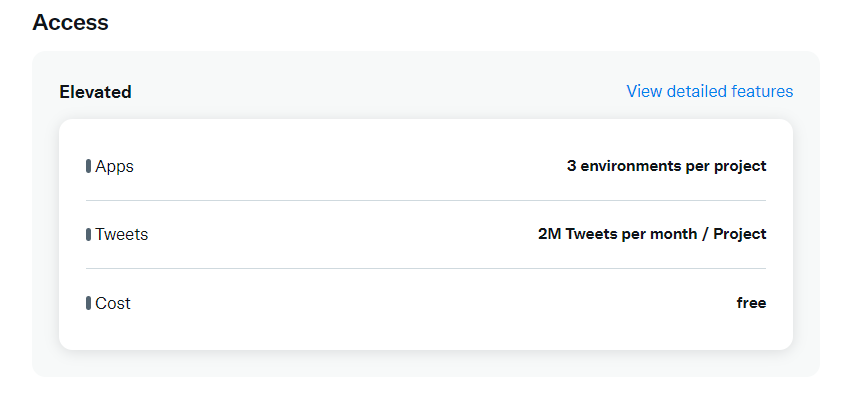

# twitter-banner-followers

<div align="center">
   
</div>

<p align="center">
 
</p>
<div align="center">
   <h1>Twitter Banner Followers</h1>
Coloca as últimas pessoas que te seguiram no Twitter dentro do banner da sua conta ;D
</div>

## Instalação:

Estou assumindo que você possui [Git](https://git-scm.com/) e [NodeJS](https://nodejs.org/en/) em seu sistema.

Usei pnpm neste projeto, então digite: (caso não tenha instalado)

```bash
npm install -g pnpm
```

Download do código:

```bash
 git clone https://github.com/pedroperegrinaa/twitter-banner-followers.git
```

Download dos módulos:

```bash
pnpm install
```
## .env

Crie um arquivo .env e preencha com os seguintes valores:

```env
API_KEY=
API_KEY_SECRET=
ACCESS_TOKEN=    
ACCESS_TOKEN_SECRET=
BEARER_TOKEN=

USER_ID=
```

**TOKENS DE ACESSO:** Pegue os seus tokens na [pagina de devs do Twitter](https://developer.twitter.com/en/portal/dashboard). Você precisa de acesso a API v1.1 e v2 do Twitter, então é necessário ter a permissão Elevated (como eles chamam)



**USER_ID:**  Você precisa definir o ID da conta que deseja coletar os seguidores. Para conseguir o ID do usuario, use este site: https://tweeterid.com/ 

## Iniciando

```bash
pnpm dev
```

Isso iniciará o monitoramento. Ao final do arquivo `index.js` temos a seguinte função:

```js
setInterval(() => {
updateBanner()
}, 60000)
```
O limite do endpoint consultado é de 15 requisições a cada 15 minutos, então o ideal é deixar em 60000 (uma requisição por minuto)

## Possiveis bugs:

Sempre delete a pasta `profile-images` antes do `pnpm dev` para evitar bugs.